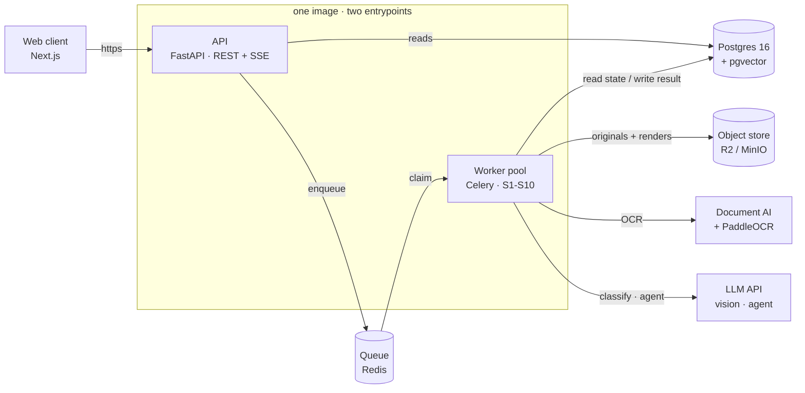

# SME Credit Readiness Assistant

Turns the messy records a Ghanaian SME actually has — MoMo statements, bank statements, receipts, invoices, a handwritten sales book — into a structured, provenance-tracked financial profile a lender can assess, plus an explicit list of what's still missing.

Full product/engineering spec: [`product-spec.md`](./product-spec.md). Stage-by-stage design docs: [`specs/`](./specs).

## System design



The API and worker pool ship from a single image with two entrypoints: the API serves the web client over REST + SSE and reads Postgres directly; the worker pool claims jobs off Redis and runs the S1–S10 pipeline (ingest → classify → extract → normalise → reconcile → categorise → analyse → score → checklist → export), writing results back to Postgres, storing originals/renders in the object store, and calling out to Document AI / PaddleOCR for OCR and the LLM API for vision extraction and the gap-filling agent.

## Repo layout

```
apps/web/       Next.js frontend (App Router, Tailwind 4, TypeScript)
specs/          Per-stage engineering specs (S1-S10, domain model, API, testing)
product-spec.md Full MVP engineering specification
Agent.md        Rules for AI-assisted changes in this repo
```

## Requirements

| Tool | Used for | Version |
|---|---|---|
| [Bun](https://bun.sh) | `apps/web` package manager + dev server | 1.3+ |
| [uv](https://docs.astral.sh/uv/) | `apps/api` Python env + package manager | latest |
| Python | `apps/api` | 3.12 |
| Postgres | shared by both apps (see below) | 16 |
| Redis | `apps/api` worker (Celery) only | any recent |

Both apps read from the **same Postgres database** — Better Auth's tables
(`apps/web`, prefixed `auth_`) and the domain model (`apps/api`, `user`,
`business`, `document`, ...) coexist without colliding. One local Postgres
instance is enough for both.

## Running locally

Start Postgres and Redis first (a throwaway local Postgres cluster works fine —
see `apps/api/README.md` "Run migrations" for a quick `initdb`/`pg_ctl` recipe if
you don't have one running).

**1. `apps/api` — backend**

```bash
cd apps/api
uv venv --python 3.12
uv pip install -e ".[dev]"
# create .env — see apps/api/README.md "Setup" for the required vars
.venv/Scripts/alembic upgrade head        # Windows; .venv/bin/... on macOS/Linux
.venv/Scripts/uvicorn app.api.main:app --reload
```

API on `http://localhost:8000` (`/docs` for OpenAPI, `/healthz` for liveness).
Run the worker separately when you need it:

```bash
.venv/Scripts/celery -A app.workers.celery_app worker --loglevel INFO
```

**2. `apps/web` — frontend**

```bash
cd apps/web
bun install
# create .env.local — see apps/web/README.md "Auth" for the required vars
bunx auth migrate -y                      # applies Better Auth's tables
bun dev
```

Web app on `http://localhost:3000`.

Full detail (env vars, auth internals, known gaps, build/lint/test commands) is
in each app's own README: [`apps/api/README.md`](./apps/api/README.md),
[`apps/web/README.md`](./apps/web/README.md).

## Contributing

See [`Agent.md`](./Agent.md) for the rules this repo's code — human or AI-written — follows (file size limits, component structure, readability).
