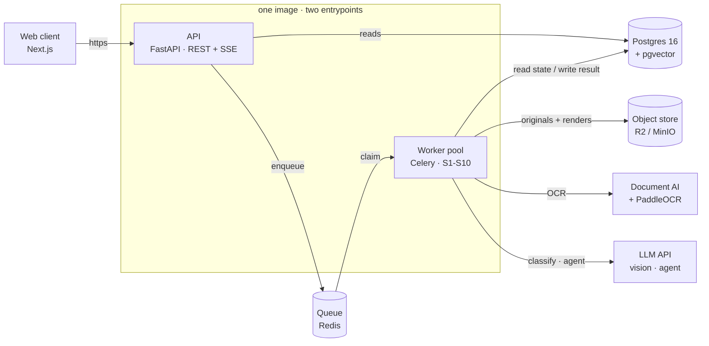

# SME Credit Readiness Assistant

Turns the messy records a Ghanaian SME actually has — MoMo statements, bank statements, receipts, invoices, a handwritten sales book — into a structured, provenance-tracked financial profile a lender can assess, plus an explicit list of what's still missing.

Full product/engineering spec: [`product-spec.md`](./product-spec.md). Stage-by-stage design docs: [`specs/`](./specs).

## System design



The API and worker pool ship from a single image with two entrypoints: the API serves the web client over REST + SSE and reads Postgres directly; the worker pool claims jobs off Redis and runs the S1–S10 pipeline (ingest → classify → extract → normalise → reconcile → categorise → analyse → score → checklist → export), writing results back to Postgres, storing originals/renders in the object store, and calling out to Document AI / PaddleOCR for OCR and the LLM API for vision extraction and the gap-filling agent.

## Repo layout

```
apps/web/       Next.js frontend (App Router, Tailwind 4, TypeScript)
specs/          Per-stage engineering specs (S1-S10, domain model, API, testing)
product-spec.md Full MVP engineering specification
Agent.md        Rules for AI-assisted changes in this repo
```

## Frontend

`apps/web` is the Next.js implementation of the product UI (owner flow: sign up, home, overview, documents, counterparties, gaps, nearly-ready checklist, assistant chat; plus the reviewer queue). Currently wired to mock data — no backend yet.

```bash
cd apps/web
bun install
bun dev
```

See [`apps/web/README.md`](./apps/web/README.md) for frontend-specific details.

## Contributing

See [`Agent.md`](./Agent.md) for the rules this repo's code — human or AI-written — follows (file size limits, component structure, readability).
